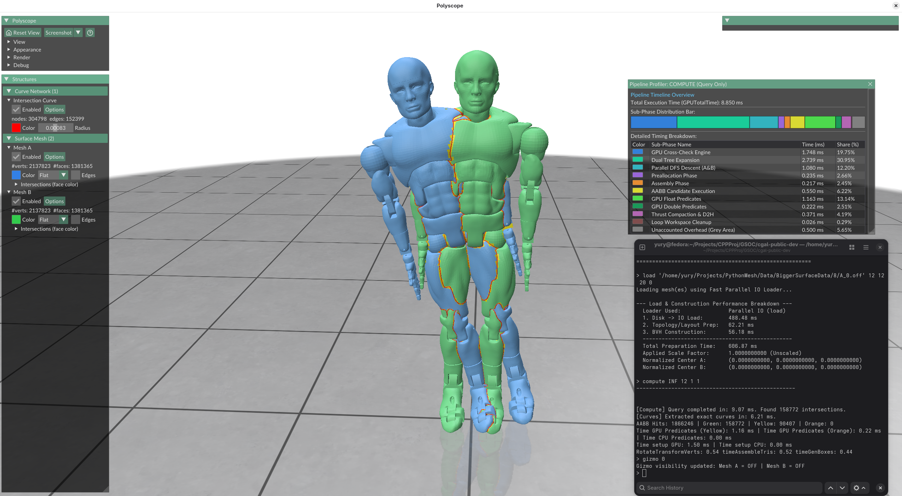

<div align="center">

# GPU-Accelerated Spatial Searching & Mesh Intersection Engine

### Google Summer of Code 2026 · Final Report

`CGAL` · `CUDA` · `cuBQL` · `Exact Geometric Predicates`

<br>



<br><br>

**Yury Elkin** · **CGAL** · **Google Summer of Code 2026**

</div>

---

## Project Information

| Field | Detail |
| :--- | :--- |
| **Contributor** | Yury |
| **GitHub Profile** | [@YuryUoL](https://github.com/YuryUoL) |
| **Organization** | [CGAL — Computational Geometry Algorithms Library](https://www.cgal.org/) |
| **Program** | Google Summer of Code 2026 |
| **Project Title** | GPU-Accelerated Spatial Searching and Mesh Intersection Engine |
| **Development Branch** | [`gsoc2026-gpu-spatial-search-YuryUoL`](https://github.com/CGAL/cgal-public-dev/tree/gsoc2026-gpu-spatial-search-YuryUoL) |
| **Standalone Repository** | [`YuryUoL/gpu-cubql-intersector-standalone`](https://github.com/YuryUoL/gpu-cubql-intersector-standalone) |
| **Primary Technologies** | C++17 · CUDA · cuBQL · CGAL · Intel TBB · Polyscope |

---

## Table of Contents

1. [Project Overview & Architecture](#1-project-overview--architecture)
2. [Algorithmic Methodology](#2-algorithmic-methodology)
3. [Interactive Viewport & Visual Results](#3-interactive-viewport--visual-results)
4. [Command Reference & Predicate Modes](#4-command-reference--predicate-modes)
5. [What's Left to Do & Future Steps](#5-whats-left-to-do--future-steps)
6. [Upstream Code Status](#6-upstream-code-status)
7. [Challenges & Key Lessons Learned](#7-challenges--key-lessons-learned)
8. [Conclusion & Acknowledgements](#8-conclusion--acknowledgements)

---

## 1. Project Overview & Architecture

Detecting exact triangle–triangle intersections and extracting 3D intersection curves between surface meshes is a major computational bottleneck in geometric processing pipelines.

The primary goal of this project was to develop a **high-throughput, hybrid GPU/CPU spatial search and mesh intersection engine for CGAL**. By offloading heavy broad-phase spatial searching to CUDA via **cuBQL** while relying on **CGAL** exact geometric predicates for numerically ambiguous cases, the engine combines massive parallel GPU throughput with guaranteed CPU-backed topological correctness.

```text
                    ┌───────────────────────┐
                    │      Input Meshes     │
                    │       Mesh A + B      │
                    └───────────┬───────────┘
                                │
                                ▼
                    ┌───────────────────────┐
                    │    GPU BVH Building   │
                    │         cuBQL         │
                    └───────────┬───────────┘
                                │
                                ▼
                    ┌───────────────────────┐
                    │  Initial Level Cross- │
                    │      Check (N, M)     │
                    └───────────┬───────────┘
                                │
                                ▼
                    ┌───────────────────────┐
                    │   Dual-Tree Traversal │
                    │    GPU Broad Phase    │
                    └───────────┬───────────┘
                                │
                                ▼
                    ┌───────────────────────┐
                    │   Batched Single-Tree │
                    │       Traversal       │
                    └───────────┬───────────┘
                                │
                                ▼
                    ┌───────────────────────┐
                    │  GPU Predicate Filter │
                    │  Float / Double / …   │
                    └───────────┬───────────┘
                                │
                     uncertain candidates
                                │
                                ▼
                    ┌───────────────────────┐
                    │   CGAL Exact CPU      │
                    │  Predicates + TBB     │
                    └───────────┬───────────┘
                                │
                                ▼
                    ┌───────────────────────┐
                    │  Exact Intersection   │
                    │        Curves         │
                    └───────────────────────┘
```

### Key Objectives & Deliverables

| | Objective | Description |
| :---: | :--- | :--- |
| 🚀 | **GPU BVH Acceleration** | Broad-phase spatial queries constructed and executed on CUDA via cuBQL. |
| 🔀 | **Parallel Dual-Tree Traversal** | Simultaneous dual-hierarchy expansion to eliminate non-overlapping volume pairs. |
| ⚡ | **Batched Single-Tree Traversal** | Parallel leaf-level searching across large candidate subtree sets. |
| 🔢 | **Multi-Tier Predicate Filter** | Fast GPU floating-point predicates backed by Intel TBB multi-threaded CPU fallback using CGAL exact arithmetic (`CGAL::Exact_predicates_exact_constructions_kernel`). |
| 🖥️ | **Interactive Viewport** | Real-time Polyscope desktop interface with interactive 3D drag gizmos and execution profiling tools. |

---

## 2. Algorithmic Methodology

The engine provides two distinct execution strategies depending on memory budgets and spatial query locality.

### 2.1 Standard Pipeline (`compute`)

Constructs full BVHs for both input meshes and executes hierarchical GPU spatial pruning:

1. **Initial Level Cross-Check (N, M)** — Constructs BVHs for both meshes, descends to levels *N* (Mesh A) and *M* (Mesh B), and runs a parallel cross-check pass to immediately discard non-overlapping subtrees.
2. **Dual-Tree Traversal** — Surviving node pairs expand simultaneously across up to four child combinations: $(A_{left}, B_{left})$, $(A_{left}, B_{right})$, $(A_{right}, B_{left})$, and $(A_{right}, B_{right})$. Bounding-volume overlap checks filter invalid branches until target subtrees are reached.
3. **Batched Single-Tree Traversal** — Subtree candidate pairs are grouped into batches. The GPU launches parallel single-tree traversals straight to leaf nodes, generating overlapping candidate triangle pairs across active CUDA threads.
4. **Multi-Stage Predicate Filtering** — Candidate triangle pairs pass through progressive numerical filters:

```text
GPU Float Predicate
   │
   ├── Classified ──────────────────────► Final Result
   │
   └── Uncertain
          │
          ▼
     GPU Double / Extended Filter
          │
          ├── Classified ───────────────► Final Result
          │
          └── Uncertain
                 │
                 ▼
          CGAL Exact CPU Predicate (+ TBB)
                 │
                 ▼
             Final Result
```

### 2.2 Partial Forest Pipeline (`standaloneCompute`)

When BVH is not used in other tasks its construction introduces unnecessary overhead. The `standaloneCompute` pipeline optimizes memory and execution time through dynamic partial-forest construction:

```text
      Full BVH                              Partial Forest

        Root
       /    \
     ...    ...                ┌─────────┐   ┌─────────┐   ┌─────────┐
    /        \                 │ Subtree │   │ Subtree │   │ Subtree │
   N          N                │    A    │   │    B    │   │    C    │
  /|\        /|\               └─────────┘   └─────────┘   └─────────┘
```

- **Bypasses Root Nodes** — Skips hierarchy construction and traversal from the root down to levels *N* and *M*.
- **Dynamic Forest Allocation** — Constructs a collection containing only the subtrees relevant to query levels *N* and *M*.
- **On-the-Fly Pruning** — Runs cross-checking and single-tree traversal exclusively on the reduced forest, saving GPU memory allocations and construction cycles.

---

## 3. Interactive Viewport & Visual Results

The primary application (`MainApp`) couples the hybrid intersector with an interactive **Polyscope** 3D viewport. Users can translate and rotate meshes in real time via interactive viewport gizmos while live intersection curves and geometric stats update dynamically.

<div align="center">


<br>

<em>Interactive Polyscope viewport displaying dynamic mesh transformation gizmos, computed intersection curves, and real-time execution statistics.</em>

</div>

---

## 4. Command Reference & Predicate Modes

### Command Reference (`MainApp`)

| Category | Command Syntax | Description |
| :--- | :--- | :--- |
| **Mesh I/O** | `load <meshA> [meshB] [qLevel] [rLevel] [leafThresh] [scale]` | Fast parallel mesh loading, normalization, and GPU BVH setup. |
| | `loadOld ...` | Legacy sequential CGAL stream loader for performance comparison. |
| **Pipeline** | `compute [batchMult] [dualTreeSteps] [predMode] [showCurves]` | Executes full GPU dual-tree / batched single-tree intersection pipeline. |
| | `standaloneCompute [qLevel] [rLevel] [batchMult] [steps] [thresh] [mode]` | Executes partial-BVH forest intersection pipeline. |
| | `ComputeCGALClassic` | Executes standard baseline CPU CGAL PMP intersector for verification. |
| **Viewport** | `gizmo <showA(0/1)> [showB(0/1)]` | Toggles interactive 3D transformation drag gizmos in the viewport. |
| | `transform <rotA> <transA> <rotB> <transB>` | Directly sets explicit 4×4 transformation matrices for Mesh A and B. |
| **GPU Memory** | `clear` | Frees GPU buffers and cuBQL trees while retaining host CPU meshes. |
| | `reconstruct <qLevel> <rLevel>` | Re-allocates device memory and rebuilds BVHs from cached CPU data. |
| **Diagnostics** | `profile` | Renders a graphical stacked timing bar chart for pipeline execution phases. |
| | `stats` / `scale` | Reports geometric precision statistics, scale factors, and degeneracies. |
| | `runSuite` / `testConfig` | Configures and executes automated benchmark parameter sweeps. |
| | `tbb <threads>` | Adjusts active CPU parallel thread limits for CGAL predicate pass. |

### GPU Predicate Evaluation Modes

| Mode | Evaluation Pipeline | Technical Description |
| :---: | :--- | :--- |
| **0** | Float → CPU fallback | Standard GPU single-precision floating-point filtering. |
| **1** | Float → Simulated Double → CPU fallback | Extended numerical precision pass prior to CPU fallback. |
| **2** | Float → Inexact Big Integer | Experimental GPU integer quantization filter. |
| **3** | Float → Exact Big Integer → CPU fallback | Experimental exact integer-based GPU filtering. |
| **4** | Float → Real Double → CPU fallback | Hardware double-precision GPU orientation filtering. |

---

## 5. What's Left to Do & Future Steps

- **Mesh Boolean Operations** — Extending intersection curve extraction to perform complete surface arrangement and Boolean operations (**Union**, **Intersection**, and **Subtraction**) directly on overlapping surface meshes.
- **Academic Publication** — Publishing a formal research paper detailing this hybrid GPU dual-tree / batched single-tree spatial search methodology, partial forest construction, and performance benchmarks against classical CPU algorithms.
- **Upstream CGAL Integration** — Finalizing generic template wrappers to package the GPU spatial intersector as an official header-only CGAL module.

---

## 6. Upstream Code Status

- **Development Branch:** [`CGAL/cgal-public-dev: gsoc2026-gpu-spatial-search-YuryUoL`](https://github.com/CGAL/cgal-public-dev/tree/gsoc2026-gpu-spatial-search-YuryUoL)
- **Standalone Repository:** [`YuryUoL/gpu-cubql-intersector-standalone`](https://github.com/YuryUoL/gpu-cubql-intersector-standalone)
- **Pull Request Status:** All code resides in the dedicated GSoC feature branch, pending complete API stabilization and header wrapping before merging into `master`.

---

## 7. Challenges & Key Lessons Learned

- **CUDA Engineering & Algorithmic Innovation** — Adapting recursive dual-tree traversal to CUDA required replacing traditional recursion with explicit, stackless parallel expansion structures to avoid thread divergence and maximize GPU occupancy. Developing **batched single-tree traversal** represented a major algorithmic innovation for handling large sets of subtree queries in parallel.
- **Hacking & Extending cuBQL** — Fulfilling CGAL's exact geometric requirements required extending cuBQL's internal traversal kernels, memory layout structures, and tree-level access routines to support multi-level cross-checking and partial forest allocation.
- **Bridging GPU Speed with Exact Arithmetic** — Proved that GPU acceleration does not require sacrificing numerical robustness. Staging cheap GPU floating-point filters before CPU exact predicates eliminates over 99% of non-intersecting candidate checks without risking topological errors near geometric degeneracies.

---

## 8. Conclusion & Acknowledgements

This project demonstrates that high-throughput GPU spatial searching and exact computational geometry can be successfully unified into a single heterogeneous pipeline. The GPU provides high-volume candidate elimination, while CGAL guarantees exact geometric correctness for complex real-world surface meshes.

Special thanks to the **CGAL community and mentors** for their invaluable guidance and support throughout Google Summer of Code 2026.
